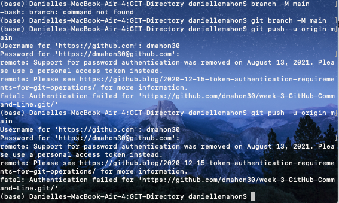

# what I was trying to do

I am trying to challenge myself by using the Terminal command line to do actions like uploading content to a Github repository, or making changes/editing content to that repo via command line.

Class resource: [Commandlinetutorial](https://graddh.netlify.app/docs/tutorials/github-cli/)

### Important commands:

`git commit`: "a snapshot of your repo at a certain time" Committed snapshots are 'safe' versions of a project-Git will never change them unless you ask them to.

`git add command` - promotes changes to the project, and will be stored in a commit.

`git commit -m "commit message"` - creates a commit with a passed commit message. 

Pushing repository onto Github for safekeeping (this came from Github's code instructions):

+ `git remote add origin githubrepoURL` - connects my remote machine to Github
+ `git branch -M main`
+ `git push -u origin main` 

### Updating repo:

(If working with collaborator, first command must be `git pull` to ensure repository is up-to-date)

1. `git add -A`
2. `git commit -m "a message"`
3. `git push`

___

## how it might connect to other research I'm doing

Since git 'snapshots' and `branches` are ways of organizing information through version control (I had to look this up: systems managing changes to software code), it could be super useful in keeping my research files neat and tidy. 

It also offers an option for peer collaboration/editing, which could be worth trying with other folks in the class.
___
## what I did

+ step 1  
	+ Installed git using Homebrew via command `brew install git`
+ step 2
	+ Using command to print a file: `echo > file.md` 
	+ Once git is installed, use command `git add file.md` to update gits record. Use command `git status` to track changes. Git will indicate that a new file has been added, and there have been no commits.
+ step 3
	+ I followed the instructions on the CYOA syllabus tutorial, however once it came to uploading the repo onto Github, *I used the Github code instructions* instead of the tutorials. There was a piece missing: the part about the branches. I'm not sure if I did this right but I was successful in uploading my remote directory to the Github repo using those code instructions.

Here are some screenshots of the code I used to get my results:

___

## challenges 

My biggest issue was that I was unable to get access to my Github repo because I hadn't set up my PAT (personal accesss token), which is required in place of a password for authentication. 

Other than that, I found the Github code for pushing directories onto a Github repo easy to follow and apply.

## thoughts on where to go next

I found this great tutorial on atlas sian with a bit more detail on the commands. I hope to use this file organization method in my research.

Link to the tutorial here: [atlassian](https://www.atlassian.com/git/tutorials/saving-changes/git-commit)
